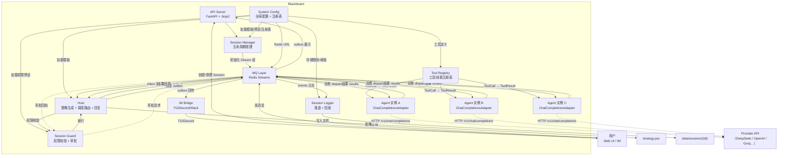
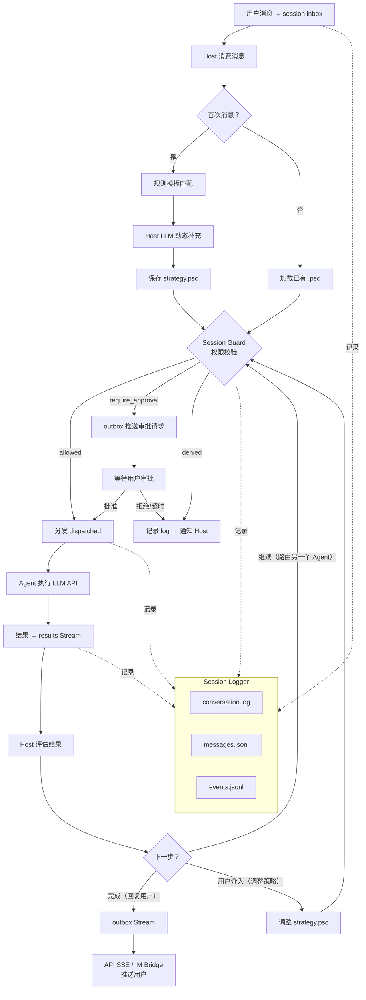
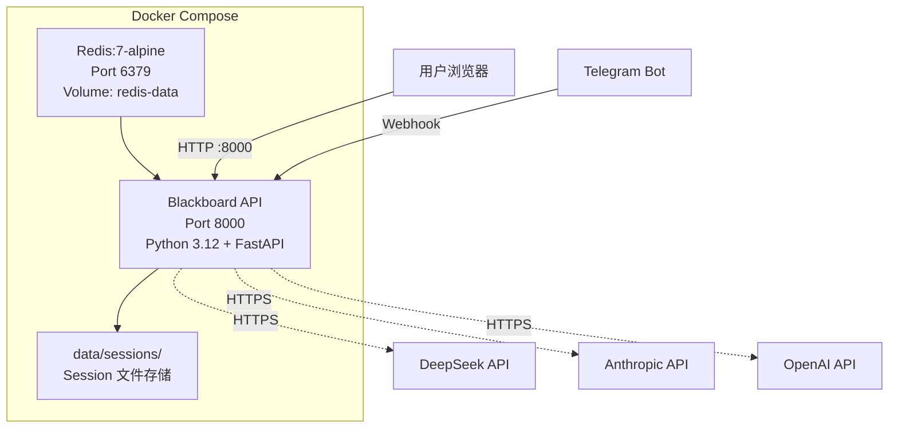

# 系统架构

> 最后更新：2026-05-26

## 架构决策

**采用方案**：事件驱动 + Agent 编排（Event-Driven Multi-Agent Orchestration）
**理由**：
- AI 是系统核心价值，需要动态编排多 LLM agent
- Agent 集成层变化最频繁，适配器模式天然解耦新增 agent 与核心调度
- 小团队 + Docker 能力，模块化单体即可承载，无需微服务的运维开销
- Redis Streams 作为事件总线，天然契合事件驱动模式
**备选方案**：模块化单体（若 agent 数量 < 5，可合并 Host + Adapters 为单进程降复杂度）

**评估**
| 维度 | 评级 | 说明 |
|------|------|------|
| 耦合度 | 极低 | Redis Streams 消费者组天然解耦 |
| 复杂度 | 中 | Streams + 消费者组 + 适配器模式 |
| 成本 | 低-中 | Docker 单机可跑，无托管服务费用 |
| 扩展路径 | 轻量 | 新增 Agent：实现 Adapter → 注册 Consumer Group 即插即用 |

## 技术栈

| 组件 | 技术 | 版本 |
|------|------|------|
| 语言 | Python | 3.12+ |
| API 框架 | FastAPI | latest |
| 消息队列 | Redis（Streams） | 7.x |
| HTTP 客户端 | httpx | latest |
| 数据序列化 | Pydantic | v2 |
| 模板引擎 | Jinja2 | latest |
| UI 风格 | Animal Island CSS | 本地 assets |
| 容器化 | Docker + Docker Compose | latest |

## 系统模块

| # | 模块 | 职责 |
|---|------|------|
| 1 | **API Server** | REST + Web UI，用户入口 |
| 2 | **Session Manager** | Session 生命周期管理（创建/暂停/恢复/关闭），Agent 动态增减 |
| 3 | **Host** | Session 内指挥中心（per-session 独立实例，互不阻塞）：.psc 编译器 + 执行器 + LLM 策略生成，接收结果，路由下一个 Agent，生成回复 |
| 4 | **Session Guard** | 权限守卫：whitelist / approval_first / open 三种模式，审批流程管理；支持分发前校验 + Agent 执行中回调校验 |
| 5 | **Agent Adapters** | 统一 OpenAI 兼容适配器（`ChatCompletionsAdapter`），支持所有暴露 `/v1/chat/completions` 端点的 Provider（DeepSeek / OpenAI / Groq / xAI / Anthropic 等）；`BaseAgent` 抽象基类定义 execute / health_check / 记忆读写契约 |
| 6 | **MQ Layer** | Redis Streams 封装（XADD / XREADGROUP / XREAD / XACK），session 级 Stream 隔离；SSE 使用 `XREAD` 广播（每客户端独立 last_id 游标），Worker 使用 `XREADGROUP` 竞争消费 |
| 7 | **IM Bridge** | 外部消息渠道适配（Telegram/Discord/Slack），统一收发接口 |
| 8 | **Session Logger** | 全量操作落盘到 session 文件夹，支持回放 |
| 9 | **System Config** | 全局配置管理：系统参数、Agent 注册表、策略模板库、权限预设、**工具注册表** |
| 10 | **Tool Registry** | 工具/技能注册表：7 个内置工具（文件读写/代码执行/HTTP/搜索），统一 ToolCall → ToolResult 接口，与 Guard 权限联动 |

## 组件关系图



## 数据流图



## Session MQ 流（Redis Streams 设计）

| Stream | 消费者组 | 生产者 | 消费者 | 用途 |
|--------|---------|--------|--------|------|
| `session:{id}:inbox` | host | API Server, IM Bridge | Host | 用户消息入口（Web UI / IM 渠道） |
| `session:{id}:dispatched` | {agent_name} | Host | Agent Adapters | Host 分发任务到 Agent |
| `session:{id}:results` | host | Agent Adapters | Host | Agent 执行结果回调 |
| `session:{id}:outbox` | outbox | Host | IM Bridge（XREADGROUP 竞争） | Host 回复回传 IM 渠道（按 `target_channel` 字段路由） |
| `session:{id}:outbox` | —（XREAD） | Host | API SSE（每客户端独立 last_id） | Host 回复广播 Web UI，多个客户端同时接收 |
| `session:{id}:approvals` | guard | API Server, IM Bridge | Session Guard | 用户审批回执 |
| `session:{id}:events` | logger | 所有组件 | Session Logger | 全量系统事件 → 写盘 |
| `session:{id}:events` | —（XREAD） | 所有组件 | API SSE（每客户端独立 last_id） | 全量系统事件广播 → 前端实时推送 |

## Session 文件夹结构

Session 内文件分两类：**业务数据**（session 发生了什么）和**运营日志**（系统运行状况）。

```
data/sessions/{id}/
│
│  ── 业务数据 ──────────────────────────────────────────
├── config.json          # Session 参数：id、name、permissions、agent 名单（纯技术，无 soul）
├── strategy.psc         # 策略伪代码（单一真相源：Host LLM 生成 / DAG 编辑器导出 / 用户手动编辑）
├── strategy.json        # 由 .psc 编译得来（只读，仅供 Host 机器执行）
├── dialog.jsonl         # 结构化对话记录（所有 Agent 可读，Host 组装 context 的原材料）
├── events.jsonl         # 业务事件流（session 创建/暂停/关闭/agent 增删/归档）
├── messages.jsonl       # MQ 消息流水（inbox/dispatched/results/outbox，待实现）
│
│  ── 各 Agent 文件（per-agent，各自独立）────────────────
├── agents/
│   └── {agent_name}/          # 每个 agent 各自拥有独立子目录
│       ├── soul.md            # 该 agent 在本 session 的角色定义（来自请求 / session 恢复 / agent_templates 三层回退）
│       └── episodic.md        # 该 agent 本 session 的 episodic thread（随 session 生灭）
│
│  ── 运营日志 ──────────────────────────────────────────
└── logs/
    ├── agent_calls.jsonl   # Agent 调用耗时 / token 用量 / 成功率
    ├── tool_calls.jsonl    # Tool 调用记录
    ├── warnings.jsonl      # Session 级 WARNING
    └── errors.jsonl        # Session 级 ERROR

data/sessions/_system/      # 跨 Session 系统日志（SessionLogger 双写）
├── warnings.jsonl
└── errors.jsonl
```

### 文件分类说明

| 类别 | 文件 | 说明 |
|------|------|------|
| **业务数据** | `config.json` | 重启恢复锚点，记录"谁在场" |
| | `strategy.psc / .json` | 协作策略，单一真相源 |
| | `conversation.log` | 对话全文 |
| | `events.jsonl` | 业务事件流（lifecycle） |
| | `messages.jsonl` | MQ 消息流水（待实现） |
| | `agents/{name}/soul.md` | 角色定义，记录"谁是谁"；**per-agent，各自独立，不属于 session 根** |
| | `agents/{name}/episodic.md` | 该 Agent 本 session 的 episodic thread；per-agent，随 session 生灭 |
| **运营日志** | `logs/agent_calls.jsonl` | 性能指标，用于监控 / debug |
| | `logs/tool_calls.jsonl` | 工具执行记录 |
| | `logs/warnings.jsonl` | 告警 |
| | `logs/errors.jsonl` | 错误 |

> **归档策略**：归档 session 时可选择只保留业务数据、丢弃 `logs/`，减小归档体积。

> **数据分层原则**：`config/` 是持久静态配置（包括 API Key），`data/sessions/` 是可清理的运行时数据。
> 清理 sessions 目录不会影响 `config/agents/credentials.enc`。

## 权限模型（Session Guard）

| mode | 含义 |
|------|------|
| `whitelist` | 仅声明的操作可用，未声明 = denied |
| `approval_first` | 所有操作需先确认，适合调试/教学 |
| `open` | 全部开放（仅 `denied` 拦截），适合信任场景 |

### 操作权限表

| 操作 | 说明 | 默认（whitelist）|
|------|------|-----------------|
| `chat` | 纯文本对话 | allowed |
| `analyze` | 分析/总结 | allowed |
| `search` | 搜索/检索 | allowed |
| `execute_code` | 执行代码 | require_approval |
| `http_request` | 发起 HTTP 请求 | require_approval |
| `file_read` | 读取文件 | allowed |
| `file_write` | 写入文件 | require_approval |
| `file_delete` | 删除文件 | denied |

## System Config（系统配置层）

全局配置独立于 Session，启动时加载，Session 创建时可覆盖，Session 运行时也可动态修改。

### 配置目录结构

```
config/                                # 静态配置（持久，跟随代码部署，不随 Session 清理）
├── system.yaml                        # 全局系统参数
├── workspace_ltm.md                   # Workspace 级 LTM（所有 Agent 均加载，跨 session 持久）
├── agents/
│   ├── registry.yaml                  # Agent 实例注册表（provider / base_url / model）
│   ├── credentials.enc                # API Key 加密存储（Fernet）
│   └── {name}/
│       └── ltm.md                     # Agent role LTM（该 Agent 跨 session 积累的知识，仅该 Agent 加载）
└── agent_templates/                   # 通用角色模板（与注册表分离，按角色命名）
    ├── host.md                        # 主持人 / 协调者
    ├── philosopher.md                 # 思辨分析者
    ├── config_assistant.md            # 配置助手
    ├── general.md                     # 通用助手
    └── ...                            # 可自由扩展
├── strategy_templates/
│   └── templates.yaml                 # 预定义工作流模板
├── permissions/
│   └── presets.yaml                   # 三套权限预设
└── tools/
    └── registry.yaml                  # 工具注册表（7 个内置工具）

data/                                  # 运行时数据（可清理，不影响配置）
├── sessions/
│   └── {session_id}/                  # Session 数据目录（见下方 Session 文件夹结构）
└── archives/
    └── {session_id}.tar.gz            # 归档数据
```

### 配置文件说明

| 文件 | 内容 | 说明 |
|------|------|------|
| `system.yaml` | Redis 地址、Session 存储路径、审批超时、最大重试次数、日志级别 | 启动时加载，全局生效 |
| `agents/registry.yaml` | 用户创建的 Agent 实例（实例名 → provider / display_name / base_url / 默认模型） | 每个实例有唯一实例名，同一 Provider 可创建多个实例 |
| `agents/credentials.enc` | 加密存储的 API Key + 模型列表（Fernet 对称加密，key 由 `FERNET_KEY` 环境变量提供） | 与 registry.yaml 同级；**不属于 Session 数据**，清理 sessions 目录不影响此文件 |
| `agents/registry.yaml` | Agent 实例注册表 | 纯技术配置，不含行为定义 |
| `agents/credentials.enc` | API Key 加密存储 | 与注册表同级，清理 sessions 不影响此文件 |
| `agent_templates/{role}.md` | 通用角色身份模板（行为、边界、风格） | Soul resolution 第 3 层回退；`registry.yaml` 的 `default_template` 字段指向文件名（不含 `.md`） |
| `strategy_templates/templates.yaml` | 四套预定义工作流模板 | 代码审查 / 协作编码 / 分析讨论 / 通用问答 |
| `permissions/presets.yaml` | 三套权限预设及其默认操作权限 | whitelist / approval_first / open |
| `tools/registry.yaml` | 7 个内置工具定义（name / handler / operation_type / parameters） | 启动时加载，与 Guard OperationType 映射 |

### 配置生效链路

```
System Config (全局默认)
    │
    ├── 创建 Session 时 ← 用户可覆盖（API 传参）
    │       │
    │       └── 写入 session config.json
    │
    └── Session 运行时 ← 可 PATCH 动态修改
            │
            └── 即时生效，通知 Host + Guard
```

> System Config 是无 LLM 的基础设施模块，只负责文件的加载、校验和热更新。

## Agent 注册表与 Session 的关系

System Config 的 `agents/registry.yaml` 管理"有哪些 Agent 类型可用"（API key、默认 model、默认 endpoint）。Session 是 Agent 的 **实例化**——用户创建 Session 时从 registry 中选择 Agent 并分配角色，Session 内不重复存储 API key。

```
registry.yaml（全局）          Session config.json（实例）
┌────────────────────┐        ┌────────────────────┐
│ deepseek:          │  选用  │ {"name":"deepseek", │
│   api_key_env: ... │ ────▶  │  "role":"程序员"}   │
│   models: [...]    │        └────────────────────┘
│ claude:            │  选用  ┌────────────────────┐
│   api_key_env: ... │ ────▶  │ {"name":"claude",  │
│   models: [...]    │        │  "role":"架构师"}   │
└────────────────────┘        └────────────────────┘
```

## Memory 架构（三层模型）

> 取代 ADR-009 原始记忆文件方案，见 ADR-018、ADR-019。

### 设计原则

| 原则 | 说明 |
|------|------|
| **Host 是唯一入口** | 所有用户消息（包括 @mention Participant 的）均先到 Host；Host 做 memory 分层判断和 context 组装后再调用 Participant |
| **Dialog 与 Log 分离** | Dialog = session 内的对话内容记录；Log = 系统运营日志（errors/warnings/metrics），两者语义不同，文件分离 |
| **Memory 归属 Agent Role，不归属 Session** | Session 只产出 dialog；memory 是 Agent 对 dialog 的加工理解，持久化在 Agent Role 上 |
| **Agent Instance 生命周期 = Session 生命周期** | Agent 实例随 session 生灭；跨 session 持久的是 Agent Role 及其 LTM |
| **越具体越近期的优先** | 运行时优先级：per-call > per-session > Agent role LTM > Workspace LTM |

### 三层结构

| Memory 术语 | 层级 | 落盘 | 持有者 | 生命周期 | 存储位置 |
|------------|------|:----:|--------|---------|---------|
| **Working Memory** | Per-call | ❌ | Agent（Host + Participant 各自） | 单次调用后丢弃 | 不持久化 |
| **Episodic Memory** | Per-session | ✅ | Host（session 级管理） | 随 session 生灭 | `dialog.jsonl` + `agents/{name}/episodic.md` |
| **Long-term Memory (LTM)** | Cross-session | ✅ | Workspace | 永久持久 | `config/workspace_ltm.md` + `config/agents/{name}/ltm.md` |

**持有者说明：**
- **Working Memory**：Host 和每个 Participant 在各自的 LLM 调用时独立持有，互不可见
- **Episodic Memory**：由 Host 统一管理和写入（Host 看得到 session 全局），Participant 可读 dialog 但不直接写
- **LTM**：归属 Workspace，不属于任何单个 session 或 agent instance；Agent role LTM 虽按 agent 命名，但其生命周期是 workspace 级

### LTM 写入路径（仅两条）

```
1. Session 结束时
   Host 从本 session dialog 和 episodic thread 中提炼有价值内容
   → 写入各 Agent role LTM 及 Workspace LTM（如适用）

2. 用户显式触发
   用户说"记住 X / 永远记住 X"
   → Host 判断写入层级（session working memory 还是 cross-session LTM）
   → 直接写入对应存储
```

### 覆写规则

**运行时优先级（高 → 低）：**

```
per-call context
  > per-session working memory
    > Agent role LTM
      > Workspace LTM
```

**写回规则：** 覆写默认临时，不自动向上传播到 LTM。  
永久变更只通过：用户显式"记住" + session 结束提炼。

**Per-session 内部覆写信号：**

| 用户表述 | 判断 |
|---------|------|
| "这个/这次/就这一次/临时" | per-call，不进 session memory |
| 无限定词 | 默认 per-session，持续生效 |
| "从现在起/以后/永远" | cross-session LTM |
| 与 session memory 冲突且无明确信号 | Host 主动问用户 |

### Host 的 Memory 职责

| 职责 | 说明 |
|------|------|
| 消息路由 | 解析 @mention，路由到目标 Participant |
| **Memory 层级判断**（新） | 分析用户输入的作用域信号，判断覆写层级 |
| **Session memory 维护**（新） | 维护 per-session working memory，检测冲突 |
| **Context 组装**（新） | 从各层 memory 组装每次 Agent 调用的 context |
| **LTM 提炼**（新） | Session 结束时，从 dialog 提炼写入各 Agent LTM |

### Episodic Memory 热/暖/冷分层

Episodic Memory 在组装 Working Memory 时按三层处理，决定哪些内容进入本次 LLM 调用的 context：

| 层 | 本质 | 内容 | 注入方式 | 压缩 |
|---|---|---|---|---|
| **热层（Hot）** | `dialog.jsonl` 末尾的滑动窗口 | 最近若干轮原文 turn | 总是注入，verbatim | ❌ 不压缩 |
| **暖层（Warm）** | Host LLM 生成的滚动摘要 | 热层溢出部分的压缩摘要 | 总是注入（存在时） | ✅ 滚动压缩 |
| **冷层（Cold）** | 主存储，append-only | 完整 `dialog.jsonl` 原文 | 不自动注入 | ❌ 原文存档 |

> **冷层是主存储**：每条 turn 在发生时立刻写入 `dialog.jsonl`，热层和暖层都不独立存储数据——热层是冷层末尾的读取视图，暖层是离开热层窗口的那部分历史的摘要。

### Budget 定义

```
model.max_output_tokens   模型硬上限（来自 models.dev limit.output），不可超越
per_call_max_tokens       本次调用实际预留的输出空间（≤ max_output_tokens），Host 按任务类型设定

可用输入 budget = context_window - per_call_max_tokens

热层 budget     = 可用输入 budget
                - soul_tokens        （固定，session 启动时已知）
                - ltm_tokens         （固定，session 启动时已知）
                - warm_tokens        （可变，随压缩增长）
                - task_tokens        （可变，当次用户消息）
                - safety_margin      （固定，约 200 tokens，补偿估算误差）
```

per_call_max_tokens 参考值：

| 任务类型 | 预留 |
|---|---|
| 简单问答 | 512 – 1024 |
| 代码生成 | 4096 |
| 长文档写作 | 8192 |
| 默认（未指定） | 2048 |

### 压缩触发机制

压缩不在"上限时"一次性触发，而是**每条新 turn 放入前**按需触发：

```
新 turn 到来（估算 token 数 = N）
    ↓
if 当前已用 + N > 热层 budget:
    弹出 hot 最旧一轮 → 追加进 warm summary（Host LLM 重新摘要）
    → 循环检查，直到空间足够
    ↓
新 turn 进入 hot 层
```

当 warm summary 本身超过 warm budget（约占可用输入的 10%）时，对 warm 再次压缩（摘要的摘要），冷层原文不受影响。

**热层填充算法（token-based，非固定 K）：**

```
从最新 turn 向前累加估算 token 数，直到热层 budget 耗尽或达到 MAX_HOT_TURNS(=50)
→ 实际装入的轮数是计算结果，不是预设值
```

每条 `dialog.jsonl` 写入时附带 `tokens` 估算字段，避免组装时重新计算：

```jsonl
{"role": "user",      "content": "...", "ts": "...", "tokens": 42}
{"role": "assistant", "content": "...", "ts": "...", "tokens": 1830, "meta": {...}}
```

### 冷层生命周期

冷层（`dialog.jsonl`）在本地与 session 同生灭，但删除前必须完成 LTM 提炼，归档后由远端长期保存：

```
Session 活跃
  → dialog.jsonl 持续 append

Session 有序关闭
  1. Host 读取完整 dialog.jsonl → LTM 提炼 → 写入 ltm.md / workspace_ltm.md   ← 必须先完成
  2. Archive：打包 archive.tar.gz → 推送远端                                    ← 远端永久保留原文
  3. 本地清理：只保留 config + strategy.psc，dialog.jsonl 本地删除

Session 异常中断
  → dialog.jsonl 保留，等待 session 恢复后继续；恢复时从冷层重建暖层摘要
```

| 状态 | 本地冷层 | 远端 |
|---|---|---|
| Session 活跃 | ✅ 存在且增长 | — |
| 正常关闭（已 archive） | ❌ 本地删除 | ✅ archive.tar.gz 中永久保留 |
| 异常中断（未 archive） | ✅ 保留，等待恢复 | — |

> LTM 提炼是门控条件：提炼未完成前，本地 dialog.jsonl 不得删除。

**冷层激活路径（平时不读）：**

| 触发 | 动作 |
|------|------|
| Session 有序关闭 | Host 读取完整 `dialog.jsonl` 提炼 LTM（门控删除） |
| 用户显式回溯（hot/warm 无细节） | Host 搜索 `dialog.jsonl` 按需注入当次 call |
| Session 恢复 | 读冷层重建暖层摘要 |
| 归档后重新提炼 | 从远端解压 archive.tar.gz，重新读取冷层 |

### Context 使用量 Logging

每次 LLM 调用后，在该轮 `dialog.jsonl` 条目的 `meta` 字段中写入：

```json
"meta": {
  "model": "claude-3-5-sonnet-20241022",
  "context_window": 200000,
  "tokens_used": 42800,
  "context_ratio": 0.214,
  "layers": {
    "soul": 1200,
    "ltm": 3400,
    "warm": 2100,
    "hot": 35600,
    "task": 500
  },
  "hot_turns": 12,
  "warm_compressed": false
}
```

系统 operational log 阈值：`context_ratio > 0.8` → WARNING；`> 0.95` → ERROR。

### Memory 文件布局

**Session 内（随 session 生灭）：**

```
data/sessions/{id}/
├── dialog.jsonl                    # 结构化对话记录（所有 Agent 可读）
└── agents/{name}/
    └── episodic.md                 # 该 Agent 本 session 的 episodic thread
```

**Cross-session（持久化，不随 session 清理）：**

```
config/
├── workspace_ltm.md                # Workspace 级 LTM（所有 Agent 均加载）
└── agents/{name}/
    └── ltm.md                      # Agent role LTM（仅该 Agent 加载）
```

## 策略执行与激活

`.psc` 生成后不会自动执行，需要用户激活：

```
任一来源 → strategy.psc 落盘
    │
    ├── 方式 1：用户手动点击「执行」
    │     POST /api/sessions/{id}/execute
    │
    ├── 方式 2：Host 生成后 → 推送确认请求到 outbox
    │     用户回复「确认」→ approvals Stream → 自动触发执行
    │
    └── 方式 3：DAG 编辑器导出 .psc → 用户点「执行」
            │
            ▼
      Host 加载 .psc → 编译器（.psc → AST）
            │
            ▼
      执行器遍历 AST → Guard 校验 → dispatched Stream → Agent 执行
            │
            ▼
      结果 → results Stream → Host 按 AST 分支/循环/跳转
```

## PSC ↔ DAG 双向互转

```
           PscParser (psc → AST → DAG 节点/连线)
         ┌───────────────────────────────────────▶
         │
  strategy.psc                            DAG 可视化编辑器
         │                                      ▲
         └───────────────────────────────────────┘
           DagSerializer (DAG 节点/连线 → psc)
```

| 方向 | 转换器 | 场景 |
|------|--------|------|
| `.psc` → DAG | `PscParser` | 用户打开已有策略进行可视化编辑 |
| DAG → `.psc` | `DagSerializer` | 用户在编辑器中拖拽完成后保存导出 |

**PscParser**：Host 的编译器将 `.psc` 解析为 AST，前端将 AST 渲染为可视化节点图。

**DagSerializer**：DAG 编辑器中的节点/连线信息序列化为 `.psc` 伪代码文本。

双向互转意味着 `.psc` 和 DAG 是同一个逻辑策略的**两种视图**，修改任一端都会同步更新另一端。

## 沙箱执行环境

Agent 的 `execute_code` 操作在受限环境中运行，防止污染宿主机。

| 方案 | 说明 | 适用阶段 |
|------|------|---------|
| Subprocess + 白名单目录 | `/tmp/blackboard-sandbox/{session_id}/` 隔离 | 初期 |
| Docker 子容器 | `docker run --rm --network=none --memory=256m` 完全隔离 | 后期升级 |

初期方案：Python `subprocess` 运行代码，仅允许对白名单目录的读写，通过 Docker Compose 的 network 隔离阻断外网访问。

## 权限守卫（Session Guard）— 中间态拦截

Guard 不仅在 Host 分发前校验，Agent 执行中如需额外操作也会回调校验：

```
Host 分派 → Guard 校验(分发前) → Agent 执行
                                    │
                    执行中想做 file_write？
                                    │
                    Agent 回传 results(含 requested_operation)
                                    │
                    Host → Guard 校验(执行中)
                           ├── allowed → 继续
                           └── require_approval → 审批流程
```

安全操作（chat/analyze/search）不触发执行中回调，仅 `require_approval` 级别的操作才需要，额外往返延迟 ~毫秒级。

## 错误类型定义

| 错误类型 | 触发条件 | HTTP 状态码 |
|---------|---------|------------|
| `AgentRegistryError` | Agent 未在 registry 中注册 | 404 |
| `MissingApiKeyError` | Agent API Key 未配置（未通过 UI 保存） | 422 |
| `InvalidApiKeyError` | LLM API 返回 401/403 | 502 |
| `SandboxExecutionError` | 沙箱内代码执行失败 | 500 |
| `StorageQuotaError` | 存储容量超限 | 507 |
| `ArchiveFailedError` | 归档操作失败 | 500 |
| `ApprovalTimeoutError` | 审批超时自动拒绝 | 408 |

## 归档与远端存储

用户手动触发 Session 归档，推送到指定远端地址：

```
POST /api/sessions/{id}/archive
Body: {
  "remote_type": "local_nas",     # local_nas | s3 | sftp
  "remote_path": "/mnt/nas/blackboard/sessions/"
}
```

归档流程：Session 文件打包为 `archive.tar.gz` → 推送到远端 → 远端写入 `log.md`（记录归档操作）→ 本地仅保留 `config.json` + `strategy.psc`。

远端类型支持：
| 类型 | 地址格式 | 依赖 |
|------|---------|------|
| `local_nas` | `/mnt/nas/blackboard/` | 挂载路径（零依赖） |
| `s3` | `s3://bucket/prefix/` | boto3 |
| `sftp` | `sftp://user@nas.local/backups/` | paramiko |

## 容量预警

`system.yaml` 配置存储阈值：

```yaml
data:
  dir: /data/blackboard/sessions   # Session 运行时数据（可清理）
  warning_threshold_gb: 10         # 触达阈值时 SSE 推 warning
  remote_default:                  # 默认远端地址（可选）
    type: local_nas
    path: /mnt/nas/blackboard/
# API Key 存储在 config/agents/credentials.enc，与 data_dir 无关
```

定时检测 `data/` 目录大小 → 触达阈值 → SSE 推送 `storage_warning` 事件 → 前端弹窗询问用户是否归档部分 Session。不自动上传，由用户决定。

## Tool Registry（工具/技能注册表）

Agent 通过工具调用执行实际操作（读文件、执行代码、发 HTTP 请求等）。7 个内置工具，统一 `ToolCall → ToolResult` 接口，与 Session Guard 权限联动。

### 工具清单

| 工具 | 操作类型 | Handler | 说明 |
|------|---------|---------|------|
| `read_file` | file_read | filesystem.read | 读取沙箱目录文件 |
| `write_file` | file_write | filesystem.write | 写入沙箱目录文件 |
| `execute_python` | execute_code | sandbox.python | 在沙箱执行 Python 代码 |
| `execute_shell` | execute_code | sandbox.shell | 在沙箱执行 Shell 命令 |
| `http_get` | http_request | network.http_get | HTTP GET 请求 |
| `http_post` | http_request | network.http_post | HTTP POST 请求 |
| `web_search` | search | search.web | 网络搜索（需配置 search API） |

### 工具调用流程

```
Agent 需要执行操作
    │
    ├── 生成 ToolCall(tool_name, parameters)
    │
    ├── Session Guard 校验 tool.operation_type
    │   ├── allowed → 执行
    │   ├── require_approval → 审批流程
    │   └── denied → 拒绝
    │
    └── ToolExecutor.execute(ToolCall)
        ├── filesystem  → 沙箱目录读写
        ├── sandbox     → subprocess 执行
        ├── network     → httpx 异步请求
        └── search      → search API 调用
            │
            └── ToolResult(success, result | error)
```

工具注册表配置：`config/tools/registry.yaml`，启动时加载。新增工具只需添加 YAML 条目 + 实现 handler。

## 关键接口

### REST API

| 方法 | 路径 | 说明 |
|------|------|------|
| POST | `/api/sessions` | 创建 session |
| GET | `/api/sessions/{id}` | 查询 session 状态 |
| POST | `/api/sessions/{id}/pause` | 暂停 session |
| POST | `/api/sessions/{id}/resume` | 恢复 session |
| DELETE | `/api/sessions/{id}` | 关闭 session（保留文件） |
| POST | `/api/sessions/{id}/messages` | 发送消息到 inbox |
| POST | `/api/sessions/{id}/execute` | 激活执行当前 .psc 策略 |
| GET | `/api/sessions/{id}/history` | 回放对话 |
| GET | `/api/sessions/{id}/strategy` | 查看当前策略 |
| POST | `/api/sessions/{id}/agents` | 运行时新增 Agent 实例 |
| DELETE | `/api/sessions/{id}/agents/{agent_id}` | 运行时移除 Agent 实例 |
| PATCH | `/api/sessions/{id}/agents/{agent_id}` | 修改 Agent 属性（角色/模型等） |
| PATCH | `/api/sessions/{id}/permissions` | 修改权限配置 |
| POST | `/api/sessions/{id}/archive` | 归档 session 到远端存储 |
| GET | `/api/sessions/{id}/archive` | 从远端拉取 session 归档文件 |
| GET | `/api/events/stream` | SSE 事件流（全局，Dashboard 使用） |
| GET | `/api/sessions/{id}/events/stream` | Per-session SSE 事件流（消费 outbox，Chat 页面实时接收 Agent 回复） |
| GET | `/api/config/agents` | 查看 Agent 实例注册表 |
| POST | `/api/config/agents` | 新增/更新 Agent 实例（upsert） |
| PATCH | `/api/config/agents/{name}` | 修改 Agent 实例属性 |
| DELETE | `/api/config/agents/{name}` | 删除 Agent 实例 |
| POST | `/api/config/agents/{name}/set-key` | 保存 Agent 的 API Key / Base URL |
| POST | `/api/config/agents/{name}/test` | 测试 Agent 连通性 |
| POST | `/api/config/agents/{name}/sync-models` | 从 Provider API 同步模型列表 |
| POST | `/api/config/agents/{name}/default-model` | 设置默认模型 |
| GET | `/api/config/providers` | 获取所有 Provider 预设（含 OpenRouter 动态列表，5 min 缓存） |
| GET | `/api/config/providers/{slug}/catalog` | 从 OpenRouter 公开 API 获取 Provider 的模型目录（仅属性数据，不含 pricing；Add 模式使用） |
| POST | `/api/config/test-connection` | 测试连通性（form 值直接测试，无需注册表；Add 模式或输入新 key 时使用） |
| GET | `/api/config/credentials` | 查看已保存凭证摘要 |
| DELETE | `/api/config/credentials/{provider_id}` | 删除 Provider 凭证 |
| GET | `/api/config/status` | 查看 Agent 连通状态汇总 |
| GET | `/api/config/templates` | 查看策略模板 |
| POST | `/api/config/templates` | 新增策略模板 |
| PATCH | `/api/config/templates/{id}` | 修改模板 |
| DELETE | `/api/config/templates/{id}` | 删除模板 |
| GET | `/api/config/permissions/presets` | 查看权限预设 |
| GET | `/api/config/tools` | 查看已加载工具列表 |

### Agent Adapter 接口

```python
class BaseAgent(ABC):
    """所有 LLM Agent 的基础契约：统一 execute / 健康检查 / 记忆读写"""
    name: str
    provider: str

    @abstractmethod
    async def load_memory(self, mem_path: str) -> str | None: ...

    @abstractmethod
    async def save_memory(self, mem_path: str, content: str): ...

    @abstractmethod
    async def execute(self, task: Task, role: str, memory: str | None) -> TaskResult: ...

    @abstractmethod
    async def health_check(self) -> bool: ...
```

### IM Bridge 接口

```python
class BaseIMBridge(ABC):
    platform: str

    @abstractmethod
    async def start(self): ...

    @abstractmethod
    async def on_message(self, user_id: str, text: str, session_id: str): ...

    @abstractmethod
    async def send_message(self, user_id: str, text: str): ...

    @abstractmethod
    async def send_approval(self, user_id: str, operation: str, context: str): ...
```

## 部署架构


